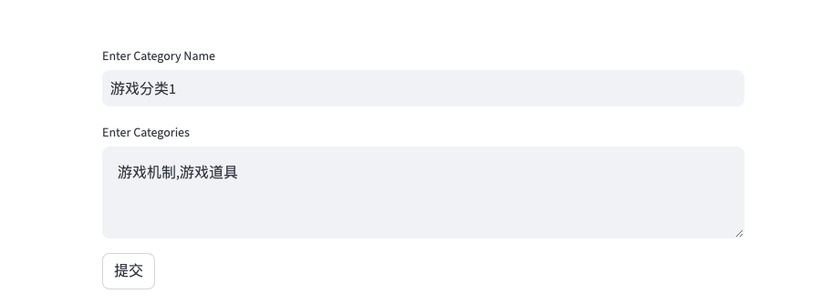

## 应用商店舆情分析系统配置说明
本文将介绍如何通过抓取应用商店玩家聊天信息,做舆情分析后,将结果发送到飞书的步骤.
### 配置游戏关键字, 本示例中: 游戏机制,游戏道具, With: Category Add

### 配置提示词 With: Prompts Add
Sample RAG Prompts:
```
You are a chat message sentiment summarizer,Here is a document in <content> you will classify and summary the senetiment
<content>
{text}
</content>
please classify the sentiment of each content into [positive,neutral,negative], then summary the content by sentiment.
Please follow below steps:
1. You will strictly be based on the document in <content>.
2. Classify the sentiment of each content into [positive,neutral,negative].
3. Then summary the chat content by sentiment.
4. Only output the summary content.
Skip the preamble, go straight into the answer.
```

Sample Sentiment Prompts:
```
You are an expert research assistant, tasked with identifying player sentiments regarding certain in-game items, neutral NPCs, and game market activities.

  Here is a document you will analyze
  <doc>
  {context}
  </doc>

  Here is a category list you will classify:
  <categories>
  游戏机制,游戏道具
  </categories>

  Below is your task:
  First, find the quotes from the document in <doc> that are most relevant to categories in <categories>, and then print them in numbered order and attach corresponding category. Quotes should be relatively short.
  If there are no relevant quotes, write "No relevant quotes" instead.
  please enclose your analysis results in xml tag <response>.

  for example:
  <response>
1. "拍卖行多香" [游戏机制]
2. "游戏太烂了" [游戏机制]
3. "屠龙刀属性太差了" [游戏道具]
  </response>

  Skip the preamble, go straight into the answer.
```
### 配置飞书渠道


### 配置用户Job
